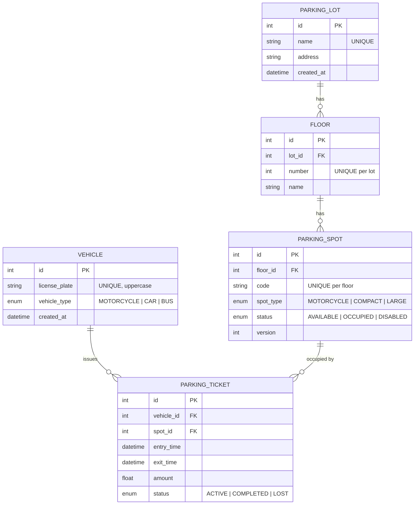

# Entity-Relationship Diagram

## Cardinality notes

- **Lot ↔ Floor**: one-to-many; a floor belongs to exactly one lot.
- **Floor ↔ Spot**: one-to-many; a spot belongs to exactly one floor.
- **Vehicle ↔ Ticket**: one-to-many; a vehicle is reused across visits.
  At most one ticket per vehicle is `ACTIVE` at a time, enforced by the
  application's `_active_ticket_for_vehicle` check before each
  check-in.
- **Spot ↔ Ticket**: one-to-many over time; at most one ticket per spot
  is `ACTIVE` at a time, enforced by the spot's `status` flag.

## Indexes

| Table              | Index                                | Purpose                                |
| ------------------ | ------------------------------------ | -------------------------------------- |
| `parking_spot`     | `spot_type`, `status`                | Allocation candidate scan              |
| `parking_spot`     | `UNIQUE (floor_id, code)`            | Spot code uniqueness                   |
| `floor`            | `UNIQUE (lot_id, number)`            | Floor numbering                        |
| `vehicle`          | `UNIQUE (license_plate)`             | Lookups by plate                       |
| `parking_ticket`   | `(vehicle_id, status)`               | "active ticket for vehicle?" — hot     |
| `parking_ticket`   | `(spot_id, status)`                  | "active ticket on spot?" — janitor jobs|
